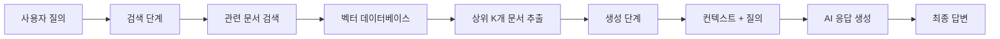
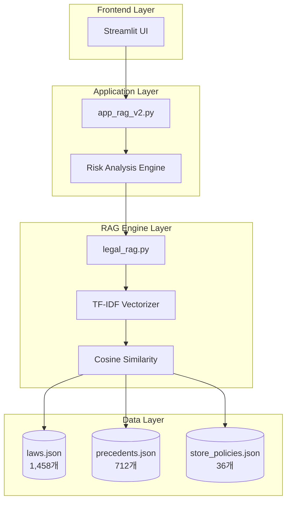
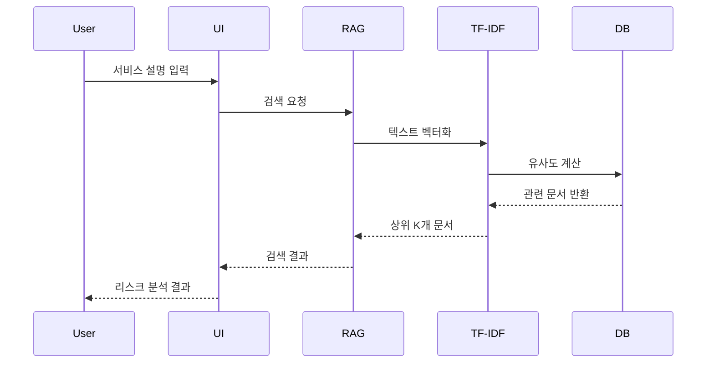
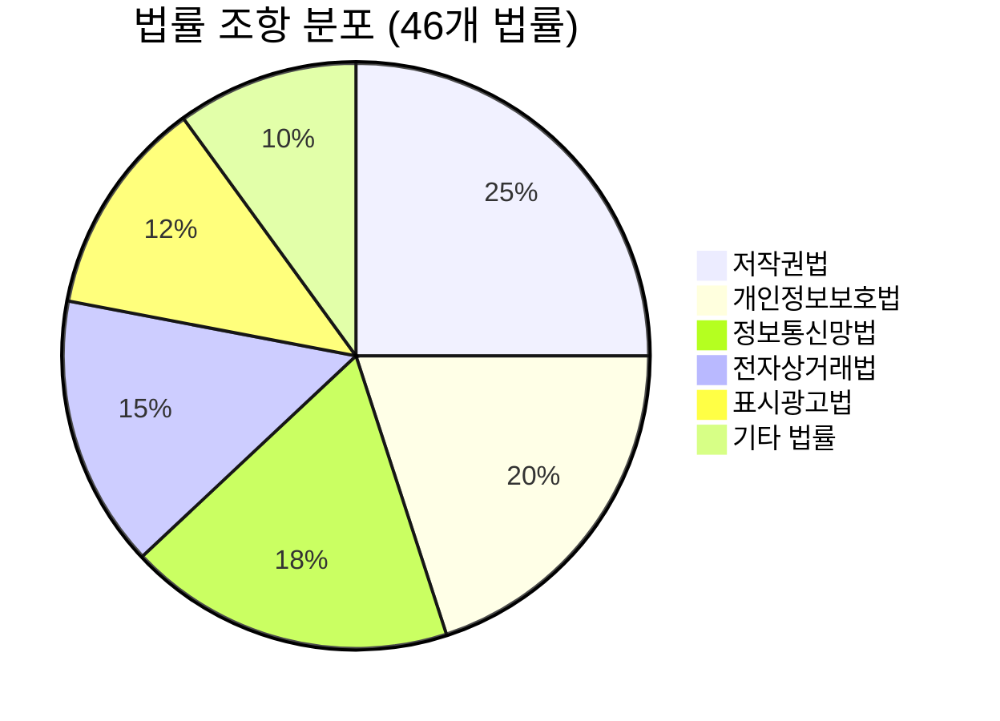
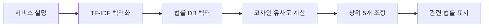
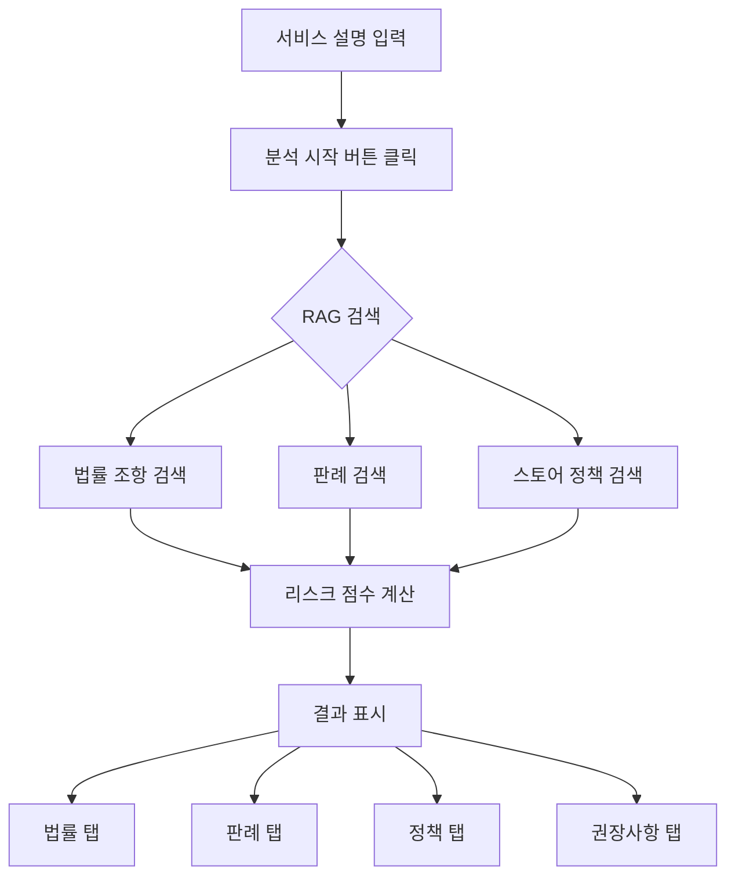
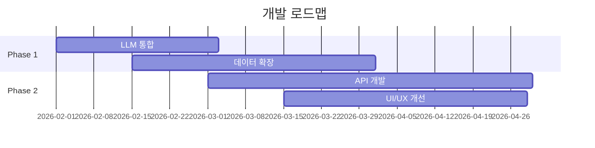

# SafeLaunch AI
## AI 기반 법률 리스크 분석 시스템

---

## 📋 목차

1. 프로젝트 개요
2. RAG 기술 소개
3. 시스템 아키텍처
4. 데이터베이스 구성
5. 핵심 기능
6. 기술 스택
7. 실행 결과
8. 향후 계획

---

## 1. 프로젝트 개요

### 🎯 목적
스타트업을 위한 AI 기반 법률 리스크 자동 분석 시스템

### 💡 핵심 가치
- **자동화**: 법률 전문가 없이도 기본적인 법률 리스크 파악
- **정확성**: 실제 법률 데이터베이스 기반 분석
- **효율성**: 수분 내 종합적인 리스크 분석 결과 제공

### 🎪 대상 사용자
- 초기 스타트업 창업자
- IT 서비스 기획자
- 법률 리스크 관리자

---

## 2. RAG 기술 소개

### RAG란? (Retrieval-Augmented Generation)



### RAG의 장점

| 전통적 AI | RAG 기반 AI |
|----------|------------|
| 학습 데이터에만 의존 | 실시간 데이터 검색 |
| 환각(Hallucination) 위험 | 검증된 데이터 기반 |
| 업데이트 어려움 | 데이터베이스만 업데이트 |
| 출처 불명확 | 명확한 출처 제공 |

---

## 3. 시스템 아키텍처

### 전체 시스템 구조



### RAG 검색 프로세스



---

## 4. 데이터베이스 구성

### 📊 데이터 현황

| 데이터 유형 | 파일 크기 | 데이터 수 | 출처 |
|------------|----------|----------|------|
| **법률 조항** | 2.51 MB | 1,458개 | 국가법령정보센터 |
| **판례** | 2.08 MB | 712개 | 법원 판례 |
| **스토어 정책** | 0.05 MB | 36개 | Google Play, App Store |
| **총합** | **4.64 MB** | **2,206개** | - |

### 법률 조항 구성



### 데이터 구조

```json
{
  "doc_id": {
    "text": "제1조(목적) 이 법은...",
    "metadata": {
      "source_type": "law",
      "law_id": "270165",
      "law_name": "저작권법",
      "proclamation_date": "20250325",
      "enforcement_date": "20250926",
      "chunk_index": 0
    }
  }
}
```

---

## 5. 핵심 기능

### 🔍 1. 법률 조항 검색

**기술**: TF-IDF + Cosine Similarity



**예시 결과**:
- 저작권법 제2조 (정의)
- 개인정보보호법 제15조 (개인정보의 수집·이용)
- 정보통신망법 제44조의7 (정보의 삭제요청)

### 📊 2. 리스크 점수 산정

**계산 공식**:

```
리스크 점수 = (법률 점수 × 0.4) + (판례 점수 × 0.4) + (정책 점수 × 0.2)

각 점수 = (검색된 항목 수 / 최대 항목 수) × 100
```

**점수 해석**:
- 🟢 **0-30**: 낮은 리스크
- 🟡 **31-60**: 중간 리스크
- 🔴 **61-100**: 높은 리스크

### 📋 3. 판례 분석

**검색 기준**:
- 유사 서비스 분쟁 사례
- 관련 법률 위반 사례
- 법원 판결 내용

### 🏪 4. 스토어 정책 검토

**검토 항목**:
- Google Play 정책 위반 여부
- App Store 가이드라인 준수 여부
- 콘텐츠 정책 적합성

---

## 6. 기술 스택

### Frontend
```
Streamlit 1.32.0
- 빠른 프로토타이핑
- 인터랙티브 UI
- 실시간 업데이트
```

### Backend
```
Python 3.8+
- scikit-learn (TF-IDF)
- numpy (벡터 연산)
- pandas (데이터 처리)
```

### RAG Engine
```
TF-IDF Vectorization
- 텍스트 → 벡터 변환
- 단어 중요도 계산

Cosine Similarity
- 벡터 간 유사도 측정
- 관련 문서 추출
```

### 데이터 소스
```
국가법령정보센터 Open API
- 최신 법률 정보
- 공식 법령 데이터
```

---

## 7. 실행 결과

### 사용 흐름



### 출력 예시

**입력**:
> "사용자가 업로드한 이미지를 AI로 편집하여 공유할 수 있는 서비스"

**출력**:
- **리스크 점수**: 65/100 (높은 리스크)
- **관련 법률**: 저작권법, 개인정보보호법
- **관련 판례**: 3건
- **스토어 정책**: 2건
- **권장사항**: 
  1. 사용자 동의 절차 강화
  2. 저작권 침해 방지 시스템 구축
  3. 개인정보 처리방침 명시

---

## 8. 향후 계획

### 단기 계획 (1-3개월)



### 기능 개선

1. **LLM 통합**
   - GPT-4 또는 Claude 연동
   - 자연어 기반 상세 분석
   - 맞춤형 권장사항 생성

2. **데이터 확장**
   - 법률 조항 10,000개 이상 확보
   - 판례 5,000건 이상 수집
   - 해외 법률 정보 추가

3. **API 개발**
   - RESTful API 제공
   - 외부 서비스 연동
   - 자동화 워크플로우 지원

4. **UI/UX 개선**
   - 대시보드 강화
   - 시각화 개선
   - 모바일 최적화

### 장기 비전

- **AI 법률 자문 플랫폼**으로 확장
- **B2B SaaS** 모델 전환
- **글로벌 서비스** 확대

---

## 📊 프로젝트 통계

| 항목 | 수치 |
|------|------|
| 총 코드 라인 수 | ~2,000 lines |
| 데이터베이스 크기 | 4.64 MB |
| 지원 법률 수 | 46개 |
| 총 데이터 항목 | 2,206개 |
| 평균 분석 시간 | < 3초 |

---

## 🔗 링크

- **GitHub**: https://github.com/s4a2z7/SafeLaunchAI
- **문서**: README.md, README_RAG.md

---

## 💡 핵심 메시지

> **SafeLaunch AI**는 RAG 기술을 활용하여 스타트업이 직면한 법률 리스크를 자동으로 분석하고, 실행 가능한 조치를 제시하는 혁신적인 솔루션입니다.

---

## Q&A

질문이 있으시면 언제든지 문의해주세요!
