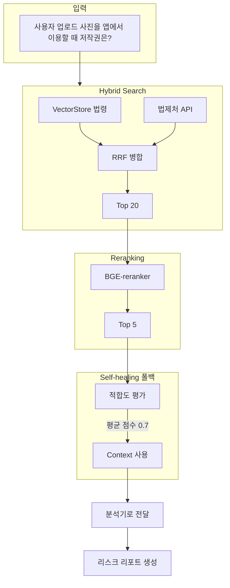

# SafeLaunch AI — RAG 예시 시나리오

## 시나리오 개요

**상황**: 1인 개발자 김개발이 수익형 앱 "포토북 메이커"를 출시하려고 한다. 앱 스토어 심사 전에 법적 리스크를 점검하고 싶어 SafeLaunch AI의 RAG 검색을 활용한다.

---

## 1. 시나리오: "사용자 업로드 사진을 앱에서 이용할 때 저작권은?"

### 1-1. 사용자 입력

```
서비스 설명: 사용자가 찍은 사진을 선택하면 앱이 AI로 배경을 제거하고 
포토북 레이아웃에 자동 배치해준다. 완성된 포토북을 인쇄·배송한다.
```

### 1-2. RAG 파이프라인 흐름



### 1-3. 검색 결과 예시 (RAG)

| 순위 | 소스 | 내용 요약 |
|------|------|-----------|
| 1 | 저작권법 | 제2조: 저작물은 창작한 사람에게 귀속... |
| 2 | 판례 | UGC 이용약관에서 권리 이용 범위 명시 필요... |
| 3 | App Store 정책 | 사용자 생성 콘텐츠 UGC 지적재산권 가이드... |
| 4 | 개인정보보호법 | 수집·이용 시 동의 필수... |
| 5 | Google Play 정책 | 사용자 콘텐츠 무단 이용 금지... |

### 1-4. 최종 분석 출력 (RAG 기반)

```
리스크 점수: 72 (Needs Fix)
요약: 사용자 사진을 포토북 제작에 이용하려면 
      이용약관에 "제작·판매·배포에 대한 권리 허락" 조항을 
      반드시 명시해야 합니다.

권장사항:
1. 이용약관에 "업로드된 사진에 대한 2차 저작물 제작·판매 권한" 명시
2. 업로드 시 별도 동의 체크박스 추가
3. 저작권법 제35조의2(저작물 이용의 보상) 검토
```

---

## 2. 시나리오: "인앱 구독 해지 방법 안내 누락"

### 2-1. 사용자 입력

```
서비스 설명: 월 9,900원 구독으로 프리미엄 포토북 템플릿을 
무제한 사용할 수 있다. 결제는 앱스토어 인앱 결제로 처리한다.
```

### 2-2. RAG 쿼리 (내부 생성)

- `"인앱 구독 해지 방법 안내 의무"`
- `"앱스토어 구독 정책 표시"`

### 2-3. 검색된 Context (요약)

- **Apple**: 구독 해지 방법을 앱 내에서 쉽게 접근 가능하게 안내할 것
- **Google Play**: 자동 갱신 구독의 해지 절차를 명확히 공개할 것
- **전자상거래법**: 사전 고지 의무

### 2-4. Self-healing 동작 예시

| 단계 | 동작 | 결과 |
|------|------|------|
| 1차 검색 | "인앱 구독" | 적합도 0.4 (폴백) |
| 재검색 | 쿼리 확장 → "인앱 결제 구독 해지 정책" | 적합도 0.8 |
| 반환 | 상위 5건 context | 분석기로 전달 |

---

## 3. 시나리오: API 호출 예시

### 3-1. Python 코드

```python
from core.legal_rag import search_legal_context

# 쿼리: 앱에서 사용자 사진을 상업적으로 이용할 때 필요한 법적 조치
results = search_legal_context(
    query="사용자 업로드 사진 상업 이용 저작권 이용약관",
    top_k=5,
    score_threshold=0.3,
    use_hybrid=True,
    use_self_healing=True,
)

for i, r in enumerate(results, 1):
    print(f"{i}. [{r['score']:.2f}] {r['metadata']['source_type']}")
    print(f"   {r['text'][:150]}...")
```

### 3-2. REST API 호출

```bash
curl "http://localhost:8000/api/search/rag?q=사용자+사진+상업+이용+저작권&top_k=5&threshold=0.3"
```

### 3-3. 응답 예시

```json
{
  "query": "사용자 사진 상업 이용 저작권",
  "count": 5,
  "items": [
    {
      "text": "저작권법 제2조 제1호에서 저작물은...",
      "metadata": {
        "source_type": "law",
        "law_name": "저작권법"
      },
      "score": 0.89
    },
    ...
  ]
}
```

---

## 4. 시나리오: RAGAS 평가 데이터 예시

### 4-1. 평가용 Q&A 쌍

| 질문 | 정답(Reference) |
|------|----------------|
| 앱에서 사용자 사진을 포토북에 쓰려면? | 이용약관에 2차 이용 권한 명시, 업로드 시 동의 필요 |
| 인앱 구독은 어떤 안내가 필요? | 구독 해지 방법을 앱 내에서 쉽게 접근 가능하게 안내 |
| 개인정보 수집 시 필수 절차는? | 정보주체 동의(개인정보보호법 제15조), 목적·보유기간 고지 |

### 4-2. 평가 실행

```bash
python eval/ragas_eval.py --llm anthropic
```

### 4-3. 기대 메트릭

- **Context Precision**: 검색된 문서가 질문에 적합한지 (목표 ≥ 0.7)
- **Faithfulness**: 답변이 context에 근거하는지 (목표 ≥ 0.8)
- **Answer Relevancy**: 답변이 질문에 맞는지 (목표 ≥ 0.75)

---

## 5. 시나리오 요약

| 단계 | RAG 역할 |
|------|----------|
| 입력 | 개발자가 서비스 설명 또는 질문 입력 |
| Hybrid Search | 벡터 DB + 법제처 API로 관련 법령·판례·정책 검색 |
| Reranking | BGE로 상위 5건 재정렬 |
| Self-healing | 적합도 낮으면 쿼리 확장 후 재검색 (폴백: 평균 점수) |
| 출력 | 분석기(Analyzer)가 context를 참고해 리스크 리포트 생성 |
| 평가 | RAGAS로 검색·답변 품질 정량 측정 |

---

## 6. 실습 체크리스트

- [ ] `search_legal_context()`로 "앱 저작권" 검색해 보기
- [ ] `use_self_healing=True`로 Self-healing 경험해 보기
- [ ] API `/api/search/rag` 호출해 보기
- [ ] RAGAS 평가 데이터에 본인 도메인 Q&A 추가해 보기
- [ ] `.env`에서 `SELF_HEALING_USE_LLM=true`로 바꿔 LLM 모드 비교해 보기
